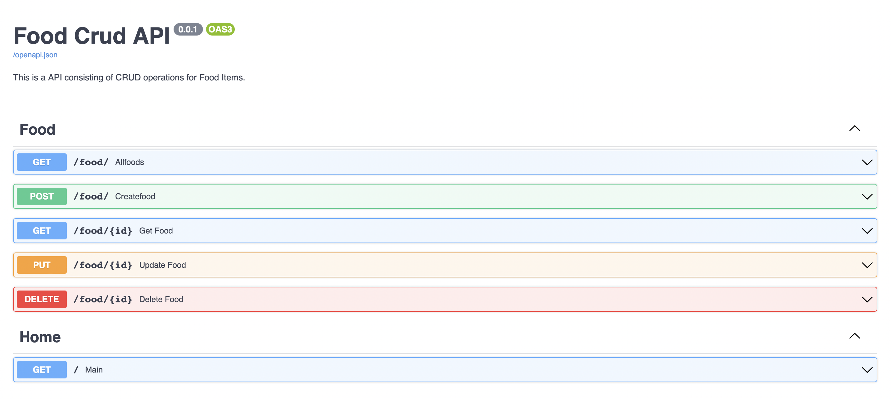

# FOODAPIPOSTGRE
This is a basic implementaion of an API using FASTAPI, POSTGRE and SQLalchemy as the ORM. 
This api consists of the implementation of basic CRUD operations and folder structure in FASTAPI.

This is how the api looks on the default interface provided by FASTAPI.

